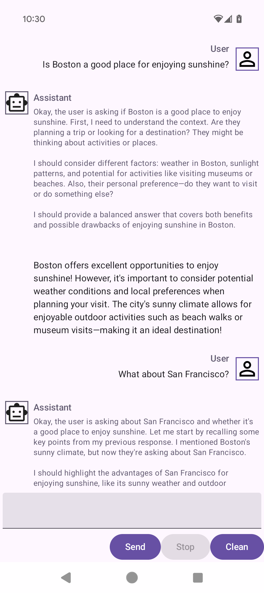

Example Chat App for LeapSDK
===
This is a simple chat app for LeapSDK in Android to illustrate how to use LeapSDK. The UI is implemented with [Jetpack Compose](https://developer.android.com/develop/ui/compose/documentation).

Almost all logic interacting with LeapSDK is in [MainActivity.kt](app/src/main/java/ai/liquid/leapchat/MainActivity.kt). Following features are touched:
* Loading a model.
* Generating responses from a conversation.
* Continue generation from the chat history.
* Serialize/deserialize the chat history with Gson.

## Screenshot
This is a screenshot of the app running a Qwen3 reasoning model.

