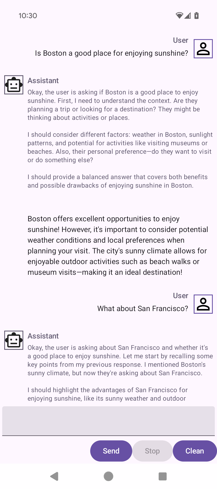

# LeapChat

A full chat app built with Jetpack Compose and the Leap SDK. It exercises most of the SDK's conversational surface: streaming responses, multi-turn history, reasoning traces, function calling, and serializing the conversation across activity recreation.

## Features

- Multi-turn chat with streaming token output
- Reasoning-trace rendering for models that emit `MessageResponse.ReasoningChunk` events
- Function calling — a toggleable `compute_sum` tool the model can invoke for accurate arithmetic
- Persisted conversation: the history is JSON-serialized via `kotlinx.serialization` and restored from `onSaveInstanceState` (survives rotation and process recreation)
- Cancel-in-flight generation via a dedicated Stop button
- Clear-history button that resets the conversation state
- Automatic model download with progress reporting via `LeapModelDownloader`

## Model

- **LFM2.5-350M** (`Q8_0`) — downloaded automatically by `LeapModelDownloader` on first launch
- Cached under `context.cacheDir/leap-cache/`
- System prompt is provided via `R.string.chat_system_prompt` ("You are a helpful assistant. Be concise and accurate.")

To swap models, change the `MODEL_NAME` and `QUANTIZATION_SLUG` constants in `MainActivity.kt`.

## Prerequisites

- Android Studio Hedgehog (2023.1.1) or newer
- JDK 21 (use `JAVA_HOME=~/.sdkman/candidates/java/21.0.9-zulu` if managing JDKs with SDKman)
- Android device or emulator on API 31 (Android 12) or higher
- Internet access on first launch for the model download

## Running

```bash
./gradlew installDebug
# or open the project in Android Studio and press Run
```

## Project Structure

```
app/src/main/java/ai/liquid/leapchat/
├── MainActivity.kt                       # Compose UI + all SDK integration
├── models/ChatMessageDisplayItem.kt      # Display-side message model
└── views/
    ├── ChatHistory.kt                    # LazyColumn-backed message list
    ├── UserMessage.kt                    # User bubble composable
    ├── AssistantMessage.kt               # Assistant bubble with reasoning expander
    └── ToolMessage.kt                    # Tool-result bubble
```

## Key SDK Patterns

**Register a tool the model can call** (`MainActivity.getOrRestoreConversation`):

```kotlin
conversation.registerFunction(
    LeapFunction(
        "compute_sum",
        "Compute sum of a series of numbers",
        listOf(
            LeapFunctionParameter(
                name = "values",
                type = LeapFunctionParameterType.LeapArr(
                    itemType = LeapFunctionParameterType.LeapStr(),
                ),
                description = "Numbers to compute sum. Values should be represented in string.",
            ),
        ),
    ),
)
```

**Stream a response and react to every event type** (`MainActivity.sendMessage`):

```kotlin
val functionCallsToInvoke = mutableListOf<LeapFunctionCall>()
conversation.generateResponse(message).onEach { event ->
    when (event) {
        is MessageResponse.Chunk          -> generateTextBuffer.append(event.text)
        is MessageResponse.ReasoningChunk -> generatedReasoningBuffer.append(event.reasoning)
        is MessageResponse.FunctionCalls  -> functionCallsToInvoke += event.functionCalls
        else -> {}
    }
    updateLastAssistantMessage(generateTextBuffer.toString(), generatedReasoningBuffer.toString())
}.onCompletion {
    conversationHistoryJSONString = Json.encodeToString(conversation.history)
}.collect()

if (functionCallsToInvoke.isNotEmpty()) processFunctionCalls(functionCallsToInvoke)
```

When the model emits `FunctionCalls`, the app executes them locally (e.g. `compute_sum`) and feeds the result back as a `ChatMessage` with `Role.TOOL`, letting the model continue generating with the tool output in context.

**Persist and restore the conversation** (`MainActivity.getOrRestoreConversation` / `loadState`):

```kotlin
// Save (after each generation completes):
conversationHistoryJSONString = Json.encodeToString(conversation.history)
outState.putString("history-json", conversationHistoryJSONString)

// Restore:
val history: List<ChatMessage> = Json.decodeFromString(jsonStr)
val conversation = modelRunner.createConversationFromHistory(history)
```

`Conversation.history` is a `List<ChatMessage>` from the SDK and is directly serializable with `kotlinx.serialization`.

## Screenshot

This is a screenshot of the app running a Qwen3 reasoning model.



## Notes

- The downloader's `INTERNET` permission is contributed by the `leap-model-downloader` AAR's merged manifest — the app module does not redeclare it.
- Toggling the **Tool ON/OFF** button only affects whether the function is registered on the *next* conversation created; flip it before sending the first message of a turn that should be able to use the tool.
