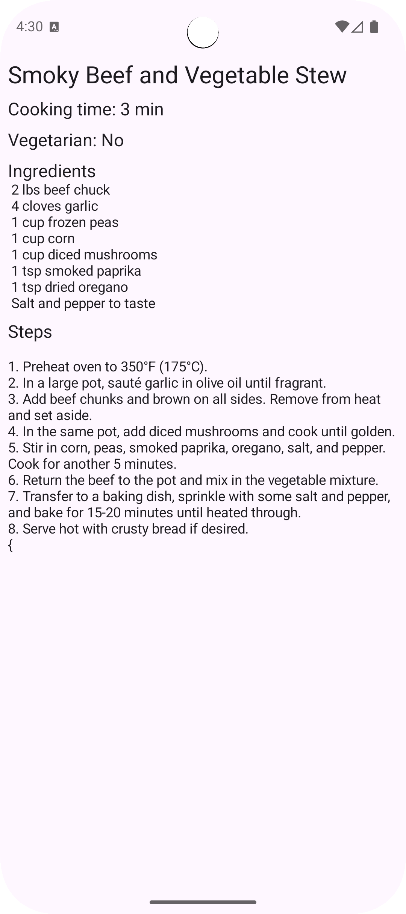

# Recipe Generator

An Android demo that uses the Leap SDK's constrained generation to produce a fully-typed `Recipe` object from a single prompt. Demonstrates `@Generatable` data classes, automatic JSON schema injection, and decoding the streamed JSON back into Kotlin.

See the [Leap constrained generation docs](https://leap.liquid.ai/docs/edge-sdk/android/constrained-generation) for the underlying concepts.

## Features

- Structured-output generation via a Kotlin data class annotated with `@Generatable` and `@Guide`
- Automatic JSON schema injection — the SDK builds the schema from the annotated class and constrains the model's decoding
- `GeneratableFactory.createFromJsonObject<Recipe>(...)` parses the model output back into a strongly-typed `Recipe`
- Automatic model download with progress UI via `LeapModelDownloader`
- Jetpack Compose UI that renders the parsed recipe (name, ingredients, cooking time, steps, vegetarian flag)

## Model

- **LFM2-700M** (Q8_0) — ~700 M parameter Liquid Foundation Model
- Downloaded automatically on first run via `LeapModelDownloader`
- Cached on-device; KV cache stored under `cacheDir/leap-cache`

## Prerequisites

- Android Studio Hedgehog (2023.1.1) or newer
- JDK 21 (with SDKman: `JAVA_HOME=~/.sdkman/candidates/java/21.0.9-zulu`)
- Android device or emulator running API 31 (Android 12) or higher
- Internet connection on first run for model download
- LeapSDK 0.10.8 (pinned in `gradle/libs.versions.toml`)

## Running

```bash
./gradlew installDebug
# or open in Android Studio and press Run
```

The app starts generating on launch — once the model finishes downloading and loading, the recipe view replaces the status text.

## Project Structure

```
app/src/main/java/ai/liquid/recipegenerator/
├── MainActivity.kt              # Compose UI; renders status or RecipeView
└── MainActivityViewModel.kt     # Recipe schema, model load + generate logic
```

## Key SDK Patterns

### Declaring the output schema with `@Generatable`

The `Recipe` data class doubles as the JSON schema. `@Guide` adds per-field hints that the SDK includes in the schema description, which improves the model's grounding:

```kotlin
@Serializable
@Generatable("A recipe for cooking great dishes")
data class Recipe(
    val name: String,

    @Guide("Ingredients for making the dishes")
    val ingredients: List<String>,

    @Guide("Cooking time in minutes")
    val cookingTime: Int,

    @Guide("Whether the meal is vegetarian")
    val isVegetarian: Boolean,

    @Guide("Steps of cooking")
    val steps: List<String>,
)
```

### Constraining generation and parsing the result

`GenerationOptions.setResponseFormatType<Recipe>()` derives the JSON schema from the class and attaches it as `jsonSchemaConstraint`. The SDK injects the schema into the system prompt and constrains decoding so the streamed text is guaranteed to be valid JSON for `Recipe`:

```kotlin
val conversation = modelRunner.createConversation(
    "You are a recipe generator bot that reads the user's message and generates JSON output."
)

val options = GenerationOptions()
options.setResponseFormatType<Recipe>()

val buffer = StringBuilder()
conversation.generateResponse("A recipe for a dinner dish", options)
    .onEach { response ->
        if (response is MessageResponse.Chunk) buffer.append(response.text)
    }
    .collect()

val recipe = GeneratableFactory.createFromJsonObject<Recipe>(
    LeapJson.parseToJsonElement(buffer.toString()).jsonObject
)
```

### Loading the model with `LeapModelDownloader`

```kotlin
val downloader = LeapModelDownloader(
    context,
    notificationConfig = LeapModelDownloaderNotificationConfig.build {
        notificationTitleDownloading = "Downloading Recipe Generator Model"
        notificationTitleDownloaded = "Model Ready!"
    },
)

if (downloader.queryStatus("LFM2-700M", "Q8_0") is LeapModelDownloader.ModelDownloadStatus.NotOnLocal) {
    downloader.requestDownloadModel("LFM2-700M", "Q8_0")
    // observe downloader.observeDownloadProgress(...) for UI updates
}

modelRunner = downloader.loadModel(
    modelName = "LFM2-700M",
    quantizationType = "Q8_0",
    options = ModelLoadingOptions(
        cacheOptions = ModelLoadingOptions.cacheOptions(
            path = context.cacheDir.resolve("leap-cache").absolutePath,
        ),
    ),
)
```

## Screenshot



## Notes

- The model is unloaded asynchronously in `ViewModel.onCleared()` on a background dispatcher to avoid blocking the main thread.
- `POST_NOTIFICATIONS` is requested on Android 13+ so the downloader's progress notification can be shown.
