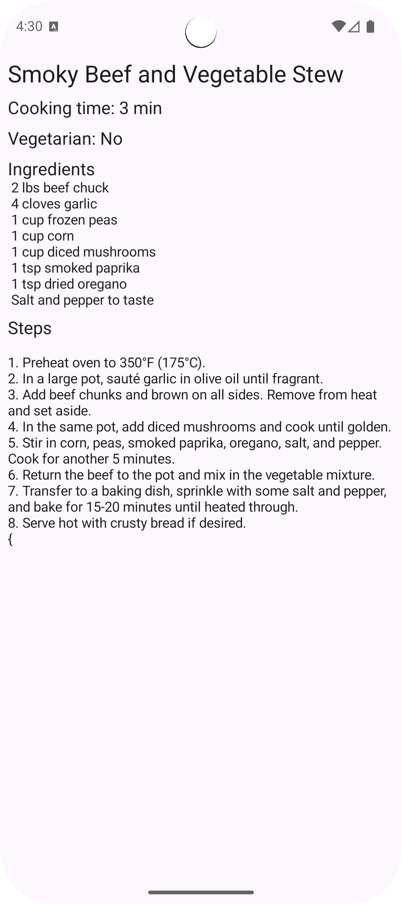

Recipe Generator
===
This example illusrate how to use LeapSDK to generate structured outputs with constraints. See [Leap document](https://leap.liquid.ai/docs/edge-sdk/android/constrained-generation) for more details.

Main business logics is in [MainActivityViewModel.kt](app/src/main/java/ai/liquid/recipegenerator/MainActivityViewModel.kt).

You need to push the LFM model bundle file to `/data/local/tmp/liquid/LFM2-700M-8da4w_output_8da8w-seq_4096.bundle` to run this demo.

## Screenshot

