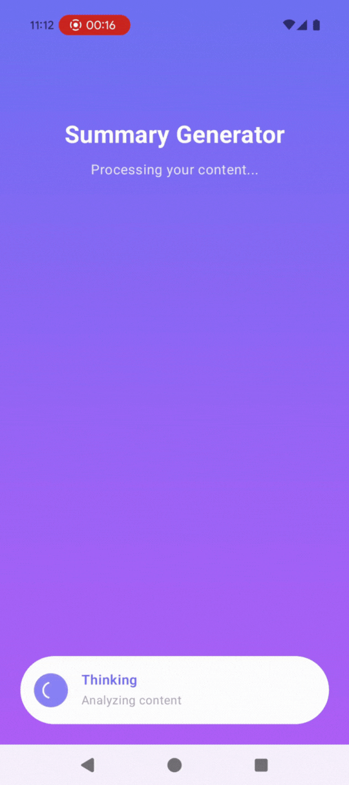

# ShareAI
Sharing the web content to this ShareAI app and get quick summary of the web page.

This example combines the local LLM ability of LeapSDK with web scraping to build a summarizer.

## Screen recording

