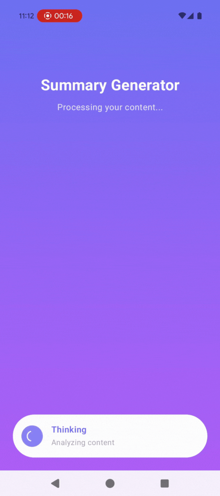

# ShareAI

Share any web URL to ShareAI from the Android share sheet and get a streaming on-device summary. Combines Jsoup-based web scraping with the Leap SDK to keep the entire summarization pipeline local after the page has been fetched.

## Features

- Registered as a `text/plain` share target via `ACTION_SEND` — share a link from any app to summarize it
- Scrapes the shared page with Jsoup, stripping `script`, `style`, `nav`, `header`, `footer`, and `aside` elements before sending the cleaned text to the model
- Streams the summary in real time with Markdown rendering (Compose Richtext + Commonmark)
- Two-ViewModel architecture cleanly separating web fetching from LLM inference
- Falls back to a built-in Liquid AI blog URL when launched without a shared link (handy for quick testing)
- Automatic model download with progress reporting via `LeapModelDownloader`

## Model

- **LFM2.5-350M** (`Q8_0`) — downloaded automatically by `LeapModelDownloader` on first launch
- Cached under `context.cacheDir/leap-cache/`
- Summarization prompt: `"Make a summary less than 500 words of the following text. Use Markdown If needed:\n\n"` followed by the scraped page text (see `AIChatViewModel.PROMPT`)

## Prerequisites

- Android Studio Hedgehog (2023.1.1) or newer
- JDK 21 (use `JAVA_HOME=~/.sdkman/candidates/java/21.0.9-zulu` if managing JDKs with SDKman)
- Android device or emulator on API 33 (Android 13) or higher
- `INTERNET` permission (declared) and an active network connection for both the model download and page scraping

## Running

```bash
./gradlew installDebug
# or open the project in Android Studio and press Run
```

To exercise the share flow: open Chrome (or any browser), tap the system share button on the current page, and pick **ShareAI** from the share sheet. The app launches with the URL pre-populated, scrapes the page, then summarizes.

## Project Structure

```
app/src/main/java/com/leap/shareai/
├── MainActivity.kt                            # Reads ACTION_SEND intent, hosts Compose tree
├── screens/SummaryAppScreenUI.kt              # Main screen, wires both ViewModels together
├── viewmodels/
│   ├── WebScrapingViewModel.kt                # Jsoup-based fetch + cleanup on Dispatchers.IO
│   └── AIChatViewModel.kt                     # Leap SDK lifecycle, streaming summary state
├── webscraping/{WebPageContent,WebPageState}.kt
└── model/ChatMessageDisplayItem.kt
```

## Key SDK Patterns

**Receive a shared URL** (`MainActivity.onCreate` and `onNewIntent`):

```kotlin
val sharedUrl = intent.takeIf {
    it.action == Intent.ACTION_SEND && it.type == "text/plain"
}?.getStringExtra(Intent.EXTRA_TEXT)
// When launched without a share intent, the activity inlines a fallback Liquid AI blog URL.
setContent { ThemeShareAi { SummaryAppScreen(linkUrl = sharedUrl ?: fallbackUrl) } }
```

`launchMode="singleTop"` in the manifest plus the duplicated `onNewIntent` handler ensure subsequent shares replace the current page instead of stacking activities.

**Scrape the page off the main thread** (`WebScrapingViewModel.scrapeWebPage`):

```kotlin
val document = Jsoup.connect(url)
    .userAgent("Mozilla/5.0 (Windows NT 10.0; Win64; x64) AppleWebKit/537.36")
    .timeout(10_000)
    .get()
document.select("script, style, nav, header, footer, aside").remove()
WebPageContent(title = document.title(), text = document.body().text().trim(), url = url)
```

**Stream the summary** (`AIChatViewModel.generateResponse`):

```kotlin
conv.generateResponse(PROMPT + scrapedText)
    .onCompletion { /* finalize state */ }
    .catch { e -> _state.value = LeapState.Error("Error: ${e.message}") }
    .collect { response ->
        when (response) {
            is MessageResponse.Chunk          -> { currentResponseText.append(response.text); _responseChunks.emit(response.text) }
            is MessageResponse.ReasoningChunk -> { currentReasoningText.append(response.reasoning); _reasoningChunks.emit(response.reasoning) }
            is MessageResponse.Complete       -> _messages.update { it + ChatMessageDisplayItem(ASSISTANT, currentResponseText.toString()) }
            else -> Unit
        }
    }
```

The ViewModel exposes both a `StateFlow<List<ChatMessageDisplayItem>>` for completed messages and a `SharedFlow<String>` of raw chunks so the UI can render a typewriter effect while the message is still streaming. `modelRunner?.unload()` is invoked from `onCleared()` on `Dispatchers.IO` to avoid ANRs.

## Screen recording



## Notes

- `usesCleartextTraffic="true"` is set in the manifest so HTTP (non-HTTPS) URLs can be scraped. Remove this if you want to restrict ShareAI to HTTPS-only.
- The default fallback URL points at a Liquid AI blog post, so launching the app from the launcher (not the share sheet) immediately produces a summary you can use to validate the model is working.
