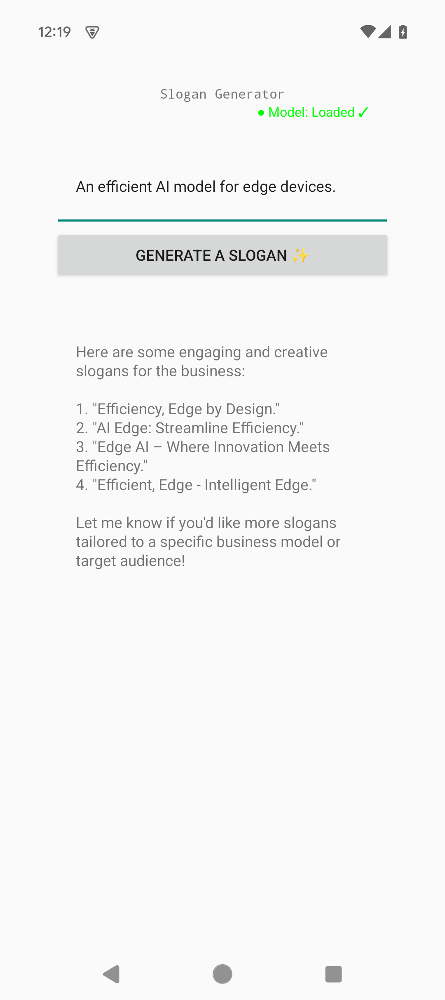

# Slogan Generator

A single-turn marketing-slogan generator built on the Leap SDK. The user describes a business and the model streams back a list of creative slogans. UI is built with classic [Android Views](https://developer.android.com/develop/ui/views/layout/declaring-layout) (XML layouts), not Compose, so it doubles as a reference for non-Compose integrations.

## Features

- Single-turn text generation with a fixed system prompt (no chat history)
- Streaming output token-by-token into a scrolling `TextView`
- Mid-generation cancellation — the Generate button toggles to Stop while a job is running
- Automatic model download with progress reporting via `LeapModelDownloader`
- Persistent on-disk cache for fast warm starts after the first launch

## Model

- **Qwen3-0.6B** (`Q8_0`) — downloaded automatically by `LeapModelDownloader` on first use
- Cached under `context.cacheDir/leap-cache/`
- The user prompt is prefixed with `/no_think` to skip Qwen3's reasoning trace and keep output concise

## Prerequisites

- Android Studio Hedgehog (2023.1.1) or newer
- JDK 21 (use `JAVA_HOME=~/.sdkman/candidates/java/21.0.9-zulu` if managing JDKs with SDKman)
- Android device or emulator on API 31 (Android 12) or higher
- Internet access on first launch for the model download
- `INTERNET` permission is declared in `AndroidManifest.xml`

## Running

```bash
./gradlew installDebug
# or open the project in Android Studio and press Run
```

On first launch tap **Generate a slogan**. The app will download the model (progress reported in the main `TextView`), load it, then stream slogans for whatever business description you typed in.

## Project Structure

```
app/src/main/
├── java/ai/liquid/sloganapp/MainActivity.kt   # All SDK + UI wiring (Views-based)
├── res/layout/main_activity_layout.xml        # XML layout (LinearLayout, EditText, Button, ScrollView, TextView)
└── res/values/strings.xml                     # User-facing strings (labels, status messages)
```

## Key SDK Patterns

**Download-on-demand and load the model** (`MainActivity.loadModel`):

```kotlin
val downloader = LeapModelDownloader(this, notificationConfig = ...)
if (downloader.queryStatus("Qwen3-0.6B", "Q8_0") is LeapModelDownloader.ModelDownloadStatus.NotOnLocal) {
    downloader.requestDownloadModel("Qwen3-0.6B", "Q8_0")
    downloader.observeDownloadProgress("Qwen3-0.6B", "Q8_0")
        .onEach { progress -> /* update UI */ }
        .takeWhile { it != null || downloader.queryStatus(...) is ModelDownloadStatus.DownloadInProgress }
        .collect()
}
modelRunner = downloader.loadModel(
    modelName = "Qwen3-0.6B",
    quantizationType = "Q8_0",
    options = ModelLoadingOptions(
        cacheOptions = ModelLoadingOptions.cacheOptions(path = cacheDir.resolve("leap-cache").absolutePath),
    ),
)
```

**Stream a single-turn generation** (`MainActivity.generateContent`):

```kotlin
val conversation = modelRunner.createConversation(SYSTEM_PROMPT)
conversation.generateResponse(USER_PROMPT_TEMPLATE.format(userInput))
    .onEach { chunk ->
        if (chunk is MessageResponse.Chunk) textView.append(chunk.text)
    }
    .onCompletion { /* reset button label */ }
    .catch { e -> /* surface error */ }
    .collect()
```

A fresh `Conversation` is created per generation, so each request is independent. `Chunk` is the only `MessageResponse` branch this demo cares about — `ReasoningChunk`, `Complete`, and `FunctionCalls` are intentionally ignored.

## Screenshot



## Notes

- The Compose dependencies in `build.gradle.kts` are pulled in transitively for theme/material support but the UI itself is Views-based; the activity calls `setContentView(R.layout.main_activity_layout)`.
- `LeapClient` is imported but unused — generation goes through `modelRunner.createConversation(...)` directly from the loaded runner.
