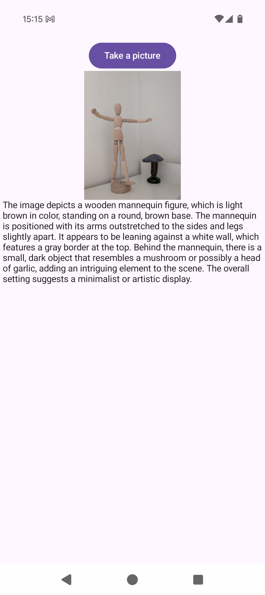

VLM Example
===
This is an example app to showcase vision language model (VLM) capability of LEAP. 

## Introduction
The whole app is built with Jetpack Compose, and image rendering is provided by [Coli](https://coil-kt.github.io/coil/) library.

A visual language model bundle is required to be pushed to the device at `/data/local/tmp/liquid/LFM2-VL-1_6B.bundle` before running the example.

## Screenshot

