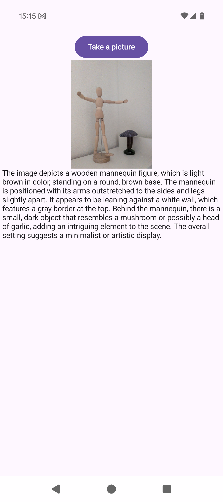

# VLM Example

An Android demo that showcases the Vision Language Model (VLM) capability of the Leap SDK. Take a photo with the device camera and the on-device model streams a natural-language description back.

## Features

- Multimodal chat with both text and image content in a single `ChatMessage`
- Streaming token-by-token response rendered with Jetpack Compose
- Automatic model download with progress UI via `LeapModelDownloader`
- Image rendering via [Coil](https://coil-kt.github.io/coil/)
- Photo capture via `ActivityResultContracts.TakePicture()` (no `CAMERA` permission required — capture is delegated to the system camera app)

## Model

- **LFM2.5-VL-1.6B** (Q8_0) — ~1.6 B parameter vision-language model
- Downloaded automatically on first run via `LeapModelDownloader` and cached under the app's internal storage
- KV cache lives under `cacheDir/leap-cache`
- Approximate download size: ~1.7 GB

## Prerequisites

- Android Studio Hedgehog (2023.1.1) or newer
- JDK 21 (with SDKman: `JAVA_HOME=~/.sdkman/candidates/java/21.0.9-zulu`)
- Android device or emulator running API 31 (Android 12) or higher
- A working camera (physical device recommended; emulator camera works but image quality is limited)
- Internet connection on first run for model download

## Running

```bash
./gradlew installDebug
# or open the project in Android Studio and press Run
```

Tap **Take a picture**, capture an image, and the model loads on the first invocation and streams a description into the screen.

## Project Structure

```
app/src/main/java/ai/liquid/vlmtestapp/
└── MainActivity.kt           # Entry point, camera intent wiring, model load + generate
```

The entire demo lives in a single `MainActivity` to keep the integration easy to read end-to-end.

## Key SDK Patterns

### Attaching an image to a chat message

A VLM request uses `ChatMessageContent.Image` alongside `ChatMessageContent.Text` inside the user message's `content` list:

```kotlin
val conversation = modelRunner.createConversation(
    "You are a helpful multimodal assistant by Liquid AI."
)

val userMessage = ChatMessage(
    role = ChatMessage.Role.USER,
    content = listOf(
        ChatMessageContent.Text("Describe this image."),
        ChatMessageContent.Image(imageData), // ByteArray of the JPEG
    ),
)

conversation.generateResponse(userMessage)
    .onEach { response ->
        if (response is MessageResponse.Chunk) {
            generateText.value = (generateText.value ?: "") + response.text
        }
    }
    .collect()
```

### Loading the model with `LeapModelDownloader`

The downloader handles fetching, caching, and progress reporting. Instantiate it once and reuse it to avoid duplicate downloads:

```kotlin
downloader = LeapModelDownloader(
    context,
    notificationConfig = LeapModelDownloaderNotificationConfig.build {
        notificationTitleDownloading = "Downloading VLM Model"
        notificationTitleDownloaded = "Model Ready!"
    },
)

val status = downloader.queryStatus("LFM2.5-VL-1.6B", "Q8_0")
if (status is LeapModelDownloader.ModelDownloadStatus.NotOnLocal) {
    downloader.requestDownloadModel("LFM2.5-VL-1.6B", "Q8_0")
    // ...observe downloader.observeDownloadProgress(...) for UI updates
}

modelRunner = downloader.loadModel(
    modelName = "LFM2.5-VL-1.6B",
    quantizationType = "Q8_0",
    options = ModelLoadingOptions(
        cacheOptions = ModelLoadingOptions.cacheOptions(
            path = cacheDir.resolve("leap-cache").absolutePath,
        ),
    ),
)
```

## Screenshot



## Notes

- The previous version of this demo required pushing `LFM2-VL-1_6B.bundle` to `/data/local/tmp/liquid/` via `adb`. That manual step is no longer needed — the SDK downloads and caches the model on first use.
- `LeapModelDownloader` posts an Android system notification with download progress; on Android 13+ ensure the user grants `POST_NOTIFICATIONS` if you want that UX.
